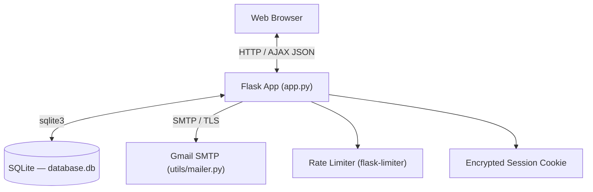
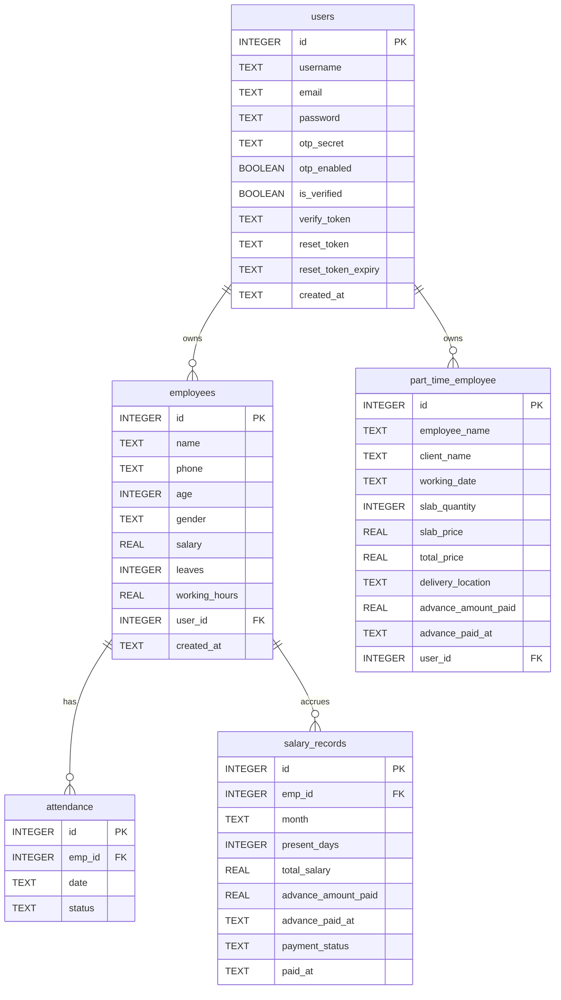
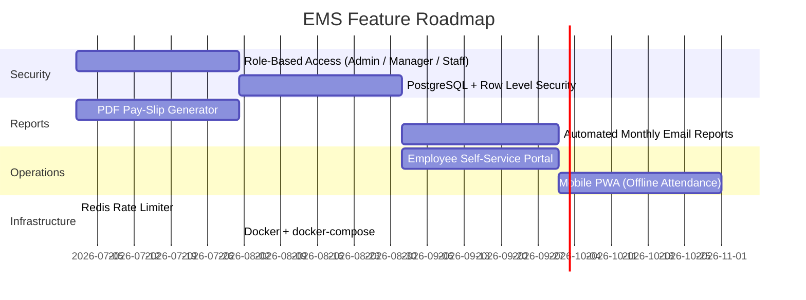

# Product Requirements Document (PRD)
## Employee Management System (EMS)

---

| Field | Details |
| :--- | :--- |
| **Product Name** | Employee Management System (EMS) |
| **Version** | 2.0.0 |
| **Stack** | Flask · SQLite · Vanilla CSS · JavaScript |
| **Status** | Active — Local & Production Ready |
| **Last Updated** | May 2026 |
| **Author** | Kamal |

---

## 1. Product Vision

The **Employee Management System (EMS)** is a self-hosted, full-stack web platform built for small-to-medium business owners to manage their workforce without spreadsheets or expensive SaaS subscriptions.

It consolidates employee records, daily attendance tracking, pro-rated payroll, part-time slab-based contracts, and financial advances into a single, fast, premium-quality dashboard — all secured with email-verified accounts, two-factor authentication, and rate limiting.

### Core Goals

| # | Goal | Description |
|---|---|---|
| 1 | **Operational Efficiency** | Eliminate manual spreadsheets for attendance and salary calculations |
| 2 | **Flexible Labour Tracking** | Support both salaried (full-time) and slab/piece-rate (part-time) workers |
| 3 | **Enterprise-Grade Security** | Email verification, TOTP 2FA, password hashing, rate limiting, session management |
| 4 | **Premium UX** | Dark/light mode, glassmorphism, smooth animations — feels like enterprise SaaS |
| 5 | **Data Portability** | One-click CSV export for accounting and audits |
| 6 | **Zero Infrastructure Cost** | SQLite, no external DB dependency, runs on a single server |

---

## 2. Architecture



### Backend
| Component | Technology |
|---|---|
| Framework | Flask 2.3+ (Python 3.12) |
| Database | SQLite 3 (via `sqlite3` stdlib) |
| Auth | SHA-256 hashed passwords, session cookies |
| 2FA | `pyotp` (TOTP — RFC 6238), `qrcode` + `Pillow` for QR |
| Email | Gmail SMTP via `smtplib`, `python-dotenv` for config |
| Rate Limiting | `flask-limiter` (in-memory, upgradeable to Redis) |
| ORM | Raw SQL with `sqlite3.Row` dict-access |
| Deployment | `gunicorn` (Procfile), Railway/Render compatible |

### Frontend
| Component | Technology |
|---|---|
| Templates | Jinja2 |
| Styling | Vanilla CSS (custom design system, 1200+ lines) |
| Charts | Chart.js 4.4 |
| Icons | Bootstrap Icons 1.11 |
| Fonts | Plus Jakarta Sans + JetBrains Mono (Google Fonts) |
| Interactivity | Vanilla JavaScript (no frameworks) |
| Theme | Dark/Light mode via `localStorage` + CSS variables |

---

## 3. Database Schema



### Table Details

#### `users`
| Column | Type | Notes |
|---|---|---|
| `id` | `INTEGER PRIMARY KEY AUTOINCREMENT` | Auto PK |
| `username` | `TEXT UNIQUE NOT NULL` | Derived from email prefix |
| `email` | `TEXT UNIQUE NOT NULL` | Login credential |
| `password` | `TEXT NOT NULL` | SHA-256 hex digest |
| `otp_secret` | `TEXT` | Base32 TOTP key |
| `otp_enabled` | `BOOLEAN DEFAULT 0` | 2FA active flag |
| `is_verified` | `BOOLEAN DEFAULT 1` | Email verified flag |
| `verify_token` | `TEXT` | One-time verify token |
| `reset_token` | `TEXT` | Password reset token |
| `reset_token_expiry` | `TEXT` | ISO expiry timestamp |
| `created_at` | `TEXT DEFAULT CURRENT_TIMESTAMP` | Registration time |

#### `employees`
| Column | Type | Notes |
|---|---|---|
| `id` | `INTEGER PRIMARY KEY AUTOINCREMENT` | Auto PK |
| `name` | `TEXT NOT NULL` | Full name |
| `phone` | `TEXT` | Contact number |
| `age` | `INTEGER` | — |
| `gender` | `TEXT` | — |
| `salary` | `REAL` | Monthly base salary |
| `leaves` | `INTEGER DEFAULT 0` | Leave balance |
| `working_hours` | `REAL DEFAULT 40` | Weekly hours |
| `user_id` | `INTEGER REFERENCES users(id)` | Owner (multi-tenancy) |
| `created_at` | `TEXT` | Onboarding timestamp |

#### `attendance`
| Column | Type | Notes |
|---|---|---|
| `id` | `INTEGER PRIMARY KEY AUTOINCREMENT` | Auto PK |
| `emp_id` | `INTEGER REFERENCES employees(id)` | Employee FK |
| `date` | `TEXT NOT NULL` | `YYYY-MM-DD` |
| `status` | `TEXT NOT NULL` | `'Present'` or `'Absent'` |

> Only "Absent" rows are stored. No row = Present by default.

#### `salary_records`
| Column | Type | Notes |
|---|---|---|
| `id` | `INTEGER PRIMARY KEY AUTOINCREMENT` | Auto PK |
| `emp_id` | `INTEGER REFERENCES employees(id)` | Employee FK |
| `month` | `TEXT NOT NULL` | `YYYY-MM` |
| `present_days` | `INTEGER DEFAULT 0` | From attendance |
| `total_salary` | `REAL DEFAULT 0` | Pro-rated net salary |
| `advance_amount_paid` | `REAL DEFAULT 0` | Advance issued |
| `advance_paid_at` | `TEXT` | Advance timestamp |
| `payment_status` | `TEXT DEFAULT 'Unpaid'` | `'Paid'` / `'Unpaid'` |
| `paid_at` | `TEXT` | Payment timestamp |

#### `part_time_employee`
| Column | Type | Notes |
|---|---|---|
| `id` | `INTEGER PRIMARY KEY AUTOINCREMENT` | Auto PK |
| `employee_name` | `TEXT NOT NULL` | Worker name |
| `client_name` | `TEXT` | Client/project |
| `working_date` | `TEXT NOT NULL` | `YYYY-MM-DD` |
| `slab_quantity` | `INTEGER NOT NULL` | Units delivered |
| `slab_price` | `REAL NOT NULL` | Price per unit |
| `total_price` | `REAL NOT NULL` | `qty × price` |
| `delivery_location` | `TEXT NOT NULL` | Destination |
| `advance_amount_paid` | `REAL DEFAULT 0` | Advance issued |
| `advance_paid_at` | `TEXT` | Advance timestamp |
| `user_id` | `INTEGER REFERENCES users(id)` | Owner |

---

## 4. Feature Specifications

### 4.1 Authentication System

| Step | Flow |
|---|---|
| **Signup** | Email + password → SHA-256 hash → `verify_token` generated → verification email sent |
| **Email Verify** | `/verify/<token>` → sets `is_verified=1`, clears token |
| **Login** | Email + password → hash compare → session set with `last_login` timestamp |
| **Remember Me** | `session.permanent=True` → 30-day session |
| **Forgot Password** | Email input → reset token + 1hr expiry → reset email sent |
| **Reset Password** | `/reset-password/<token>` → validates token + expiry → update hash |
| **2FA Setup** | `/otp/setup` → `pyotp.random_base32()` → QR code (Base64 PNG) → confirm code |
| **2FA Verify** | On login: if `otp_enabled=1` → intercept → `/otp/verify` |
| **Logout** | `session.clear()` → redirect to login |

**Security notes:**
- Forgot password never reveals if email exists (prevents user enumeration)
- Tokens use `secrets.token_urlsafe(32)` — cryptographically secure
- Reset tokens consumed on use, expire in 1 hour

---

### 4.2 Analytics Dashboard

**KPI Cards:**
| Metric | Source |
|---|---|
| Total Employees | `COUNT(*)` from `employees` |
| Average Salary | `AVG(salary)` |
| Average Age | `AVG(age)` |
| Total Weekly Hours | `SUM(working_hours)` |
| This Month Present | Aggregated attendance |
| This Month Absent | Aggregated attendance |

**Charts:** Chart.js bar chart — present vs absent per employee for selected month. Data via `/api/v1/chart/attendance?month=YYYY-MM`.

**Activity Feed:** Last 10 attendance events.

---

### 4.3 Employee Management

| Action | Route | Method |
|---|---|---|
| List / Search | `/employees?q=` | GET |
| Add | `/employees` (form POST) | POST |
| Edit | `/employees/edit/<id>` | GET, POST |
| Delete | `/employees/delete/<id>` | POST |
| Export CSV | `/export` | GET |

- Name search via query string `?q=`
- All queries scoped to `user_id` (multi-tenancy)
- Cascade delete removes all attendance + salary records

---

### 4.4 Attendance Engine

| Feature | Detail |
|---|---|
| Date selector | Calendar picker, defaults to today |
| Roster | Full employee list for selected date |
| Toggle | Click to flip Present ↔ Absent |
| Storage | Only "Absent" stored; missing row = Present |
| Updates | AJAX POST to `/attendance/mark` — no page reload |
| Summary | `/attendance/summary` — monthly counts per employee |

---

### 4.5 Payroll Engine

**Lazy Init:** Records auto-generated on first visit for selected month.

**Formulas:**
```
Daily Rate   = Base Salary ÷ Days in Month
Total Salary = Daily Rate × Present Days
Net Payable  = Total Salary − Advance (can be negative)
```

| Action | API |
|---|---|
| Set advance | `POST /salary/set_advance` |
| Mark paid | `POST /salary/mark_paid` |
| View sheet | `GET /salary?month=YYYY-MM` |

---

### 4.6 Part-Time / Slab Tracking

Fields: Employee name, client, date, slab qty, price/unit, delivery location, advance.

```
Total Price = slab_quantity × slab_price
Net Payable = Total Price − Advance  (supports negative)
```

---

### 4.7 Profile Popup

Triggered by clicking navbar avatar + chevron.

| Feature | Implementation |
|---|---|
| Avatar | Gradient circle, first letter of name |
| User info | Fetched from `/api/v1/profile-info` |
| Last Login | Stored in session on each successful login |
| Edit Profile | Display name → `localStorage` |
| Change Password | POST to `/api/v1/change-password` (rate limited 5/hr) |
| Theme Toggle | Animated pill, synced with navbar button |
| Sign Out | Clears session |
| Close | Click outside / Esc / × button |

---

### 4.8 Legal & Compliance Panel

Footer slide panel with 4 tabs: Privacy Policy, Terms of Service, Data Compliance, Security Information.

---

### 4.9 CSV Export

Downloads `employee_data_YYYY-MM-DD.csv` with three sections:
- `=== EMPLOYEES ===`
- `=== ATTENDANCE ===`
- `=== SALARY RECORDS ===`

---

## 5. API Reference

### Page Routes

| Route | Method | Auth | Description |
|---|---|---|---|
| `/` | GET | — | Router: dashboard or login |
| `/signup` | GET, POST | — | Register |
| `/verify/<token>` | GET | — | Email verification |
| `/resend-verification` | POST | — | Re-send verify email |
| `/login` | GET, POST | — | Login |
| `/forgot-password` | GET, POST | — | Request reset |
| `/reset-password/<token>` | GET, POST | — | Reset password |
| `/logout` | GET | ✅ | Sign out |
| `/otp/setup` | GET | ✅ | TOTP setup + QR |
| `/otp/setup/confirm` | POST | ✅ | Enable 2FA |
| `/otp/verify` | GET, POST | Partial | Verify OTP on login |
| `/otp/disable` | POST | ✅ | Disable 2FA |
| `/dashboard` | GET | ✅ | KPI dashboard |
| `/employees` | GET, POST | ✅ | List + add employees |
| `/employees/edit/<id>` | GET, POST | ✅ | Edit employee |
| `/employees/delete/<id>` | POST | ✅ | Delete employee |
| `/attendance` | GET | ✅ | Attendance sheet |
| `/attendance/summary` | GET | ✅ | Monthly summary |
| `/salary` | GET | ✅ | Payroll sheet |
| `/part-time` | GET, POST | ✅ | Part-time tracker |
| `/export` | GET | ✅ | Download CSV |

### JSON API

| Endpoint | Method | Limit | Description |
|---|---|---|---|
| `/attendance/mark` | POST | — | Toggle Present/Absent |
| `/salary/mark_paid` | POST | — | Mark salary paid |
| `/salary/set_advance` | POST | — | Set salary advance |
| `/part-time/set_advance` | POST | — | Set part-time advance |
| `/api/v1/chart/attendance` | GET | — | Chart data |
| `/api/v1/profile-info` | GET | — | Current user info |
| `/api/v1/change-password` | POST | 5/hr | Change password |

#### Sample Payloads

```json
// POST /attendance/mark
{ "emp_id": 4, "date": "2026-05-23", "status": "Absent" }
→ { "success": true, "status": "Absent" }

// POST /salary/set_advance
{ "emp_id": 12, "month": "2026-05", "advance_amount_paid": 1500.00 }
→ { "success": true, "advance_amount_paid": 1500.0, "advance_paid_at": "2026-05-23 06:40:00" }

// POST /api/v1/change-password
{ "current_password": "old123", "new_password": "new1234!", "confirm_password": "new1234!" }
→ { "ok": true, "message": "Password changed successfully." }

// GET /api/v1/chart/attendance?month=2026-05
→ { "labels": ["Kamal", "Rajesh", "Priya"], "present": [28, 25, 30], "absent": [2, 5, 0] }
```

---

## 6. Security Model

| Layer | Implementation |
|---|---|
| Password Hashing | `bcrypt` rounds=12 (with legacy SHA-256 fallback & auto-migration) |
| Security Headers | `flask-talisman` enforcing CSP, X-Frame-Options, X-Content-Type-Options |
| CORS | `flask-cors` utilizing explicit origins with supports_credentials |
| Email Verification | `secrets.token_urlsafe(32)`, consumed on use |
| Password Reset | Cryptographic token, 1-hour expiry |
| Session Security | Flask encrypted sessions with `SameSite=Strict`, `HttpOnly`, `Secure` |
| Route Guards | `@login_required` decorator |
| Multi-Tenancy | All queries filter `WHERE user_id = ?` |
| 2FA | RFC-6238 TOTP, 30s window, `pyotp` |
| Rate Limiting | `flask-limiter` per IP |
| User Enumeration | Forgot password always shows success |
| Payload Size Limit | Restricts body size to 1MB (`MAX_CONTENT_LENGTH` limit) |
| Liveness/Readiness | `/health` and `/ready` endpoints |
| Error Monitoring | `sentry-sdk` integration with header key scrubbing |
| Logging | Structured JSON logger output |

### Rate Limits Table

| Endpoint | Limit |
|---|---|
| `POST /login` | 10 per minute |
| `POST /signup` | 5 per hour |
| `POST /forgot-password` | 5 per hour |
| `POST /resend-verification` | 3 per hour |
| `POST /api/v1/change-password` | 5 per hour |
| Global fallback | 300/day, 60/hour |

---

## 7. UI / UX Design System

**Philosophy:** Enterprise SaaS — premium HRMS feel. Dark by default, full light mode.

### Color Tokens

| Token | Light | Dark | Usage |
|---|---|---|---|
| `--bg` | `#f0f4f8` | `#0d1117` | Page bg |
| `--card` | `#ffffff` | `rgba(255,255,255,0.035)` | Cards |
| `--primary` | `#3b82f6` | `#3b82f6` | CTAs, links |
| `--purple` | `#8b5cf6` | `#8b5cf6` | Accent |
| `--success` | `#10b981` | `#10b981` | Paid/verified |
| `--danger` | `#ef4444` | `#ef4444` | Errors/delete |
| `--warning` | `#f59e0b` | `#f59e0b` | Pending |

### Typography
- **Headings:** Plus Jakarta Sans 800
- **Body:** Plus Jakarta Sans 400–600
- **Code:** JetBrains Mono

### Key Components
- Glassmorphism cards with `backdrop-filter: blur`
- Profile popup with spring-physics animations
- Auth pages — two-column layout + feature pitch panel
- Password strength meter (5 levels)
- Animated pill theme toggle
- Toast system (success / danger / warning / info)
- Legal slide panel with tab navigation
- Loading spinner overlay
- AJAX attendance toggles

---

## 8. Email System

### Configuration (`.env`)
```ini
MAIL_SERVER=smtp.gmail.com
MAIL_PORT=587
MAIL_USERNAME=your@gmail.com
MAIL_PASSWORD=<16-char app password>
MAIL_FROM=your@gmail.com
MAIL_FROM_NAME=EMS
APP_BASE_URL=http://127.0.0.1:5000
SECRET_KEY=<random-secret>
```

### Email Types

| Email | Trigger | Notes |
|---|---|---|
| Verification | Signup | Blue gradient, button + plain-text link |
| Password Reset | Forgot password | Amber/red, button + 1hr warning + plain-text |

- Both send **HTML + plain-text** (multipart/alternative) — prevents Gmail link mangling
- Links always logged to server console for local dev

---

## 9. Deployment

```bash
# Local
python app.py  # → http://127.0.0.1:5000

# Production
gunicorn app:app  # Railway/Render via Procfile
```

**Required env vars for production:**
- `SECRET_KEY` — never use default in production
- `DATABASE_PATH` — path on persistent volume
- All `MAIL_*` vars + `APP_BASE_URL`

---

## 10. Non-Functional Requirements

| Requirement | Target |
|---|---|
| Response Time | < 200ms for all API calls |
| Availability | 99.9% (managed PaaS) |
| Browser Support | Chrome, Firefox, Safari, Edge (latest 2 versions) |
| Mobile Responsive | Down to 375px — sidebar collapses |
| Data Integrity | SQLite WAL mode, FK cascade deletes |
| Portability | Single `.db` file — trivial to backup |
| Scalability | Swap SQLite → PostgreSQL with minor changes |

---

## 11. Future Roadmap



| Priority | Feature | Description |
|---|---|---|
| 🔴 High | **PDF Pay Slips** | Generate & email pro-rated pay slips |
| 🔴 High | **RBAC** | Admin / Manager / Staff roles |
| 🟡 Medium | **PostgreSQL** | Multi-server support with RLS |
| 🟡 Medium | **Employee Portal** | Separate login for employees to view payslips |
| 🟡 Medium | **Redis Rate Limiter** | For multi-process/multi-server deployments |
| 🟢 Low | **PWA / Offline** | Service worker for offline attendance |
| 🟢 Low | **Scheduled Reports** | Monthly email digest of payroll |
| 🟢 Low | **Docker** | `docker-compose.yml` for one-command deploy |
